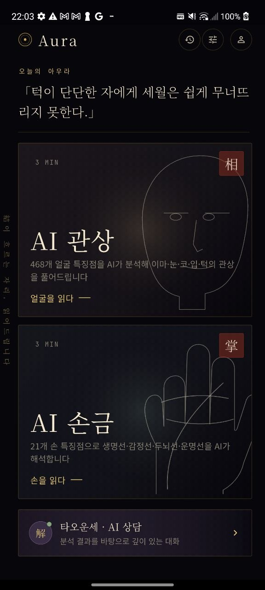
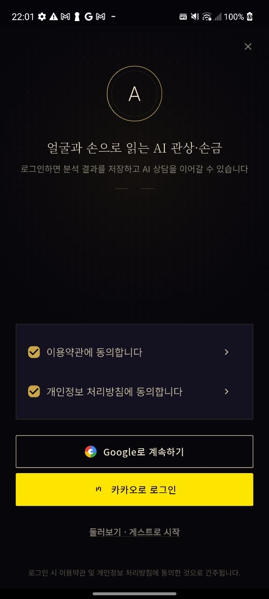
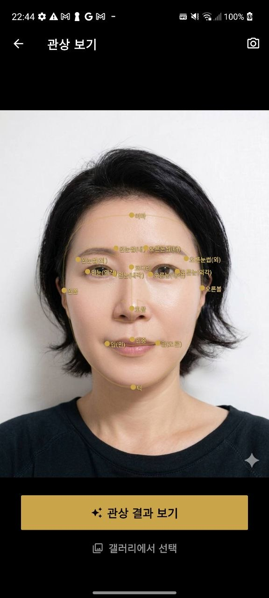
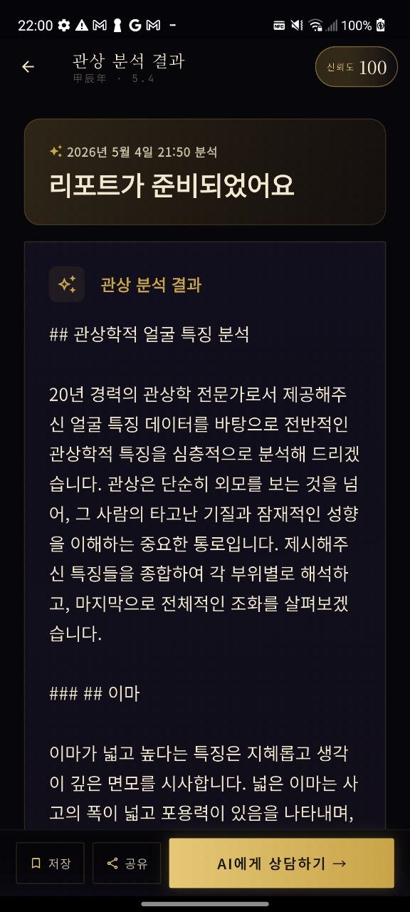
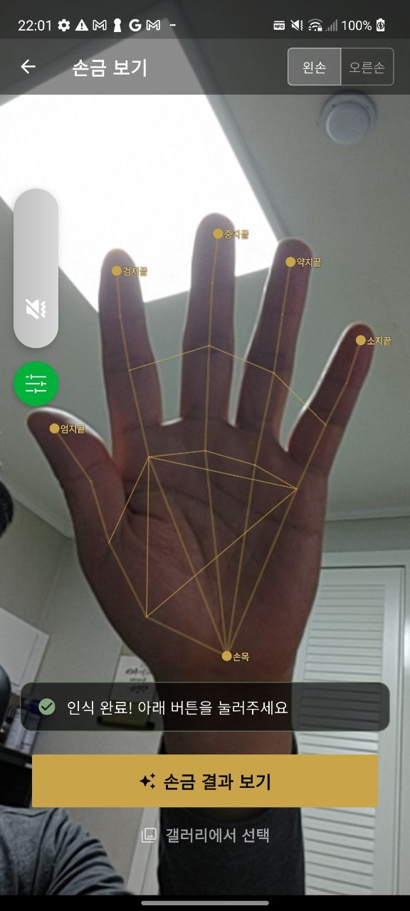
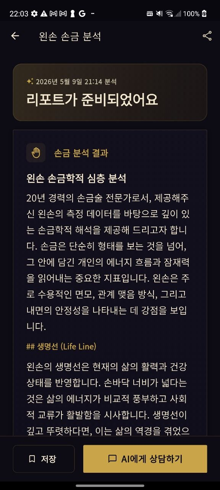
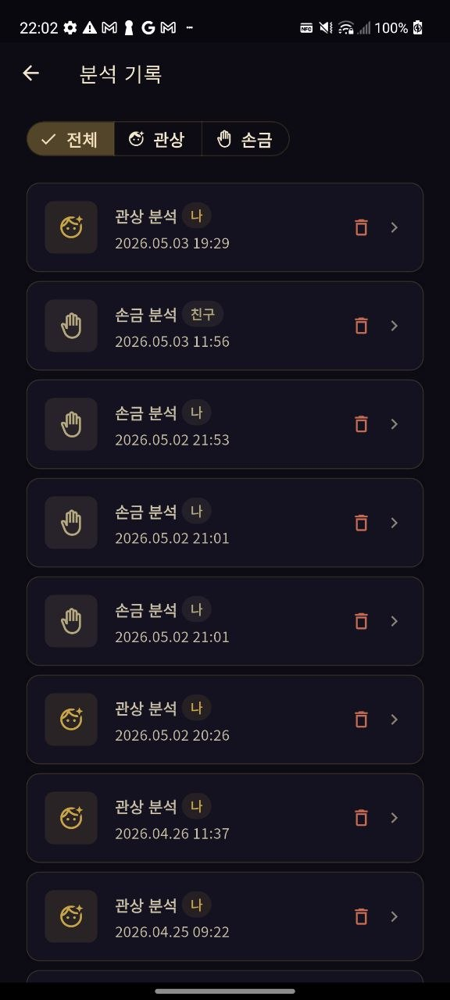
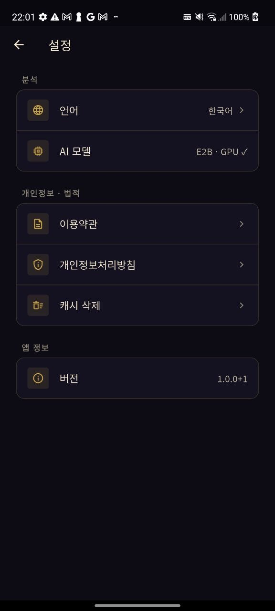

<div align="center">

<br/>

# ✦ Aura

**결이 흐르는 자리, 읽어드립니다**

*On-device AI face & palm reading — your data never leaves your device*

<br/>

[](https://flutter.dev)
[](https://dart.dev)
[](https://developer.android.com)
[](https://ai.google.dev/gemma)
[](https://developers.google.com/ml-kit)
[](https://supabase.com)
[](#license)

</div>

---

## What is Aura?

Aura is a privacy-first Android app that reads your **face** (관상, physiognomy) and **palm** (손금, palmistry) entirely on-device.

Point your camera — **Google ML Kit** maps 468 facial landmarks or 21 hand keypoints in real time, then **Gemma 4** streams a 1,000+ character reading without a single byte leaving your phone.

No cloud AI calls. No image uploads. No server-side processing. Everything happens on your device.

---

## Screenshots

<div align="center">

### Home & Auth

| Home | Login |
|:---:|:---:|
|  |  |
| AI 관상 · AI 손금 · AI 상담 | Google · Kakao OAuth |

### Face Reading

| Camera & Landmark Detection | Analysis Result |
|:---:|:---:|
|  |  |
| 468-point mesh → 17 key indices | 1,000+ char Gemma 4 report |

### Palm Reading

| Camera & Hand Tracking | Analysis Result |
|:---:|:---:|
|  |  |
| 21-point HandLandmarker overlay | Life · Heart · Head · Fate lines |

### History & Settings

| Reading History | Settings |
|:---:|:---:|
|  |  |
| Face & palm records | Language · AI model · Privacy |

</div>

---

## How it works — Privacy by Design

```
Your camera
    │
    ▼
ML Kit Face Mesh / HandLandmarker   ← runs on-device (xnnpack / GPU)
    │  468 face landmarks
    │   21 hand keypoints
    ▼
Feature extraction
    │  17 physiognomy indices
    │  line & mount measurements
    ▼
Gemma 4 E2B / E4B (.litertlm)       ← runs on-device, no network call
    │
    ▼
Streaming result (1,000+ chars)
    │
    ▼  (only if user taps Save)
Supabase Storage                    ← optional, explicit user action only
```

> **Camera frames are never uploaded. AI inference runs 100% on-device.**  
> Internet is used only for: user account sync, optional reading history save, and first-time model download.

---

## Why On-Device?

Running both a Vision AI model and a multi-gigabyte LLM entirely on a smartphone — with no server in the loop — is an uncommon architecture. Most apps offload at least one of these to the cloud. Here's why it matters and what makes it technically non-trivial.

### Privacy

Face and palm images are inherently personal biometric data. On-device processing means the raw camera frames are processed locally and discarded; nothing is transmitted. Users don't need to trust a third-party server with their biometrics.

### Zero cloud inference cost

Every analysis runs on the user's GPU/NPU. There are no cloud GPU calls regardless of how many users run readings simultaneously — the marginal cost per inference is zero.

### The engineering challenge

**Running a multi-GB LLM on a phone is not straightforward:**
- Gemma 4 E2B/E4B weights are 2.5–5 GB. Loading them into the constrained RAM of a mobile device requires careful quantization and memory layout.
- Inference must complete in a reasonable time without thermal throttling or out-of-memory crashes.
- The app selects E2B or E4B automatically based on available RAM and GPU tier to balance quality against device capability.

**Connecting Vision AI to the LLM without a server:**
- ML Kit extracts structured numeric data (landmark coordinates, ratios, symmetry scores) from raw camera frames at 15 fps.
- That data is serialized into a text prompt and handed to Gemma in the same process — no network hop, no serialization overhead across services.
- Each analysis uses a fresh Gemma chat session to prevent context accumulation across readings.

---

## Tech Highlights

### Google ML Kit — Vision AI

- **Face Mesh Detection** (`google_mlkit_face_mesh_detection`): extracts all 468 landmarks at 15 fps using the xnnpack delegate. 17 key physiognomy points (forehead, eyes, nose, mouth, chin, cheeks, eyebrows) are derived and fed to the AI.
- **Hand Landmark Detection** (`hand_landmarker`): tracks 21 hand keypoints in real time. Line geometry (life, heart, head, fate lines) is computed from the landmark graph before any AI call.
- No MediaPipe model files ship in the APK — ML Kit handles model management automatically.

### Gemma 4 — On-Device LLM

- Runs **Gemma 4 E2B (~2.5 GB) or E4B (~5 GB)** locally via `flutter_gemma ^0.13.2`.
- Two prompt modes: a short real-time overlay prompt (2–3 sentences) and a long-form result prompt (1,000+ chars, section-structured).
- Every analysis opens a **fresh chat session** — no context leaks between readings.
- Model selection is automatic: E4B on RAM ≥ 8 GB + GPU tier, E2B otherwise.
- Locale-aware: prompts are loaded from `assets/prompts/{face|palm}_{ko,en,ja,zh}.txt`.

---

## Features

| | Feature | Detail |
|---|---|---|
| 👁️ | **AI Face Reading** | 468-point ML Kit mesh → 17 physiognomy indices → Gemma 4 |
| 🤚 | **AI Palm Reading** | 21-point HandLandmarker → line detection → Gemma 4 |
| 💬 | **AI Consultation** | Post-reading chat with Aura (Gemma 4 session) |
| 📜 | **Reading History** | Save & revisit past readings — face and palm, filterable |
| 🌐 | **4 Languages** | Korean · English · Japanese · Chinese |
| 🔒 | **Zero Data Leakage** | Vision AI + LLM run fully on-device |
| 🌙 | **Obsidian × Gold UI** | Dark-first design with warm antique-gold accents |
| 🔑 | **Flexible Auth** | Guest mode · Google OAuth · Kakao Login |

---

## Architecture

```
┌──────────────────────────────────────────────────────┐
│                Flutter App (Clean Arch)               │
│                                                      │
│  Presentation ── Riverpod 2.x + go_router            │
│  Domain       ── UseCases / Entities                 │
│  Data ┬── camera + ML Kit (on-device)                │
│       ├── flutter_gemma  (on-device .litertlm)       │
│       └── Supabase Client                            │
└──────────────────────────────┬───────────────────────┘
                               │ (auth + history sync only)
              ┌────────────────▼──────────────────┐
              │          Supabase                  │
              │  Auth · Postgres · Storage         │
              │  pgvector · Edge Functions         │
              └────────────────────────────────────┘
```

---

## Tech Stack

| Layer | Technology |
|---|---|
| Framework | Flutter 3.x / Dart 3.10 |
| On-device LLM | Gemma 4 E2B / E4B via `flutter_gemma ^0.13.2` |
| Face Vision | `google_mlkit_face_mesh_detection` — 468 landmarks |
| Hand Vision | `hand_landmarker` — 21 keypoints |
| State management | Riverpod 2.x + code generation |
| Navigation | go_router 14 |
| Backend | Supabase (Auth, Postgres, Storage, pgvector) |
| Auth | Google Sign-In · Kakao (Edge Function proxy) |
| i18n | flutter_localizations + ARB (KO / EN / JA / ZH) |
| Design | Flex Color Scheme · Google Fonts · Lottie |

---

## Getting Started

### Prerequisites

- Flutter ≥ 3.x — `flutter --version`
- Android device or emulator, **API 28+**, arm64-v8a recommended
- A [Supabase](https://supabase.com) project
- Gemma 4 model file (`.litertlm`) — downloaded automatically on first launch

### 1. Clone & install

```bash
git clone https://github.com/<your-username>/gwansang.git
cd gwansang
flutter pub get
```

### 2. Configure environment

```bash
# Never commit this file
cat > .env << EOF
SUPABASE_URL=https://your-project.supabase.co
SUPABASE_ANON_KEY=your-anon-key
KAKAO_NATIVE_KEY=your-kakao-key   # optional
EOF
```

```bash
flutter run \
  --dart-define=SUPABASE_URL=$SUPABASE_URL \
  --dart-define=SUPABASE_ANON_KEY=$SUPABASE_ANON_KEY
```

### 3. Supabase setup

Apply the schema from `docs/spec.md §9` to your Supabase project, then deploy the Edge Functions in `supabase/functions/`.

### 4. Model

On first launch Aura will download the appropriate Gemma 4 model automatically.  
Alternatively, place a `.litertlm` file in `/sdcard/Download/` — the app will detect and register it.

| Model | Size | When selected |
|---|---|---|
| Gemma 4 E2B | ~2.5 GB | Default (most devices) |
| Gemma 4 E4B | ~5 GB | RAM ≥ 8 GB + high GPU tier |

---

## Project Structure

```
lib/
├── core/
│   ├── theme/         # Obsidian + Gold design tokens
│   ├── l10n/          # ARB files (ko / en / ja / zh)
│   ├── router/        # go_router
│   └── constants/
├── data/
│   ├── gemma/         # GemmaService + PromptBuilder
│   ├── mlkit/         # FaceMeshService + HandLandmarkService
│   └── supabase/      # Auth + Reading repositories
├── domain/
│   ├── entities/
│   └── physiognomy/   # Landmark index constants (17 face / 21 hand)
└── features/
    ├── splash/
    ├── home/
    ├── auth/
    ├── face_reading/       # camera + result
    ├── palm_reading/       # camera + result
    ├── consultation/       # AI chat
    ├── history/
    ├── settings/
    ├── model_setup/
    └── policy / terms/
```

---

## Internationalization

Strings live in `lib/core/l10n/app_{ko,en,ja,zh}.arb`. After editing, regenerate:

```bash
flutter gen-l10n
```

AI prompts are locale-specific: `assets/prompts/{face|palm}_{ko,en,ja,zh}.txt`

---

## Security

- Supabase **anon key** only in client — `service_role` key is Edge Function–only.
- Camera frames stay on-device; images upload to Storage only on explicit save.
- RLS policy: `user_id = auth.uid()` on all reading rows.
- Model files (`.litertlm`) and secrets (`.env`, `google-services.json`) are gitignored.

---

## Roadmap

- [x] Face reading — 468-point ML Kit mesh
- [x] Palm reading — HandLandmarker
- [x] AI consultation chat (Gemma 4)
- [x] 4-language support (KO / EN / JA / ZH)
- [x] Google · Kakao OAuth
- [x] Reading history
- [ ] iOS support (Sign in with Apple)
- [ ] Export reading as PDF / shareable card image
- [ ] 사주 (Four Pillars of Destiny) module
- [ ] Admin KB contribution & re-embedding workflow

---

## License

MIT © 2025 taoist

---

<div align="center">

*Aura reads the lines that tell your story.*

</div>
